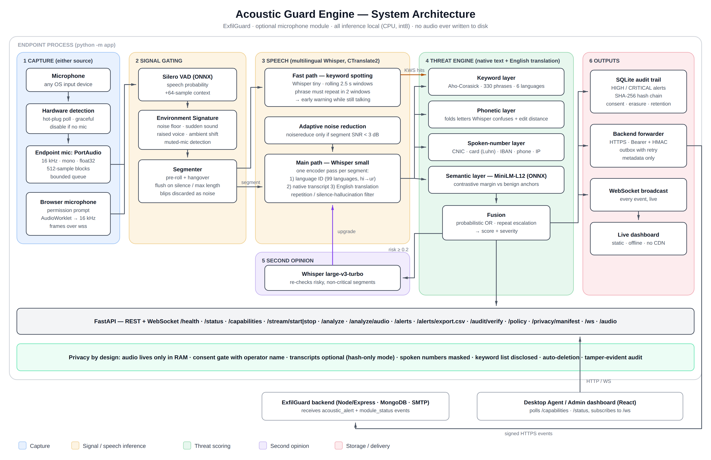

# Acoustic Guard Engine — Module Document

**ExfilGuard · AI-Powered Multi-Vector Data Leak Prevention System**
Module: Optional Microphone-Based Acoustic Guard
Owner: Umae Habiba (235054) · Team: Anas Zeeshan (231250), Faisal Ali (231320)
Supervisor: Dr. Syed Muhammad Sajjad · Co-supervisor: Ma'am Hina Batool
Version 2.1.0

---

## Contents

1. Overview and scope
2. Traceability to the project proposal
3. Architecture and pipeline
4. Multilingual design
5. Threat model and scoring
6. Model selection and evaluation
7. Privacy by design and GDPR / PDPA compliance
8. API reference and integration contracts
9. Installation and running
10. Configuration reference
11. Testing
12. Measured results
13. Integration guide for the team
14. Limitations and future work
15. Defence Q&A

---

## 1. Overview and scope

The Acoustic Guard detects **verbal disclosure of sensitive information**: someone saying a
password, a project codename, a customer's CNIC number or bank details out loud, or talking
about taking data out of the company. It is the only ExfilGuard layer that covers the spoken
channel, which no commercial DLP product monitors (proposal §4.2).

It runs as a self-contained local service on the endpoint:

- **Listens** to the microphone continuously, in memory only.
- **Detects speech** with a voice-activity model, so nothing is analysed while the room is quiet.
- **Transcribes** each utterance in whatever language is spoken and translates it to English.
- **Scores the risk** with four independent detectors (keywords, phonetic matching,
  spoken-number patterns, semantic intent) fused into one severity.
- **Records** HIGH / CRITICAL findings in a tamper-evident audit trail, pushes them live to a
  dashboard and forwards them to the ExfilGuard backend.
- **Never writes or transmits audio.** Only the detected phrases, a score, a language code and a
  timestamp leave the analysis step.

The module is **optional and hardware-dependent** (proposal §3.4, §7.7). It checks for a
microphone at start-up and keeps checking. Without one it reports `disabled_no_hardware`, and
the rest of ExfilGuard is unaffected.

## 2. Traceability to the project proposal

| Proposal item | What it asks for | Where it is implemented | Verified by |
|---|---|---|---|
| Obj. 7, §7.9 | VAD + keyword spotting + Whisper transcription | `app/vad.py`, `app/kws.py`, `app/transcriber.py` | `test_vad.py`, `test_kws.py`, `test_speech_fixtures.py` |
| §7.9, Fig. 7 | noise suppression with noisereduce before analysis | `app/preprocess.py` (adaptive, see §6.3) | `test_preprocess.py` |
| §7.9 | alert only when a keyword is matched in several consecutive frames | `KeywordSpotter` — phrase must appear in 2 consecutive windows | `test_kws.py` |
| §8.6 | structured alert (keyword, timestamp, context metadata) | `forwarder.build_alert_event` | `test_forwarder.py` |
| §8.6 | alerts over authenticated HTTPS to the backend | `app/forwarder.py`: Bearer token + HMAC-SHA256 signature, retry outbox | `test_forwarder.py` |
| §8.6 | live push to the admin dashboard | WebSocket `/api/v1/ws` + `static/` dashboard | `test_api.py`, browser QA |
| §8.6 | Environment Signature Analysis | `app/environment.py` | `test_environment.py` |
| §3.4, §7.7, Obj. 5 | hardware detection, graceful disable, hot-plug | `app/hardware.py` | `test_hardware.py`, `test_api.py` |
| §8.6 table | explicit consent recorded in the audit log | consent gate + `consent_log` in the hash chain | `test_audio_stream.py`, `test_storage.py` |
| §8.6 table | data minimisation, no audio of any kind | RAM-only buffers; `store_transcript=false` keeps only a hash | `test_privacy.py` |
| §8.6 table | local processing only | every model runs on the endpoint (ONNX Runtime / CTranslate2) | offline test run |
| §8.6 table | right to information: users can see the keyword list | `GET /api/v1/policy/keywords`, "Monitored keywords" panel | `test_api.py` |
| §8.6 table | configurable retention | `ACOUSTIC_RETENTION_DAYS`, hourly purge, erasure endpoint | `test_storage.py` |
| §8.6 table | audit trail with integrity hashing | SHA-256 hash chain over alerts, consent and erasure; `/audit/verify` | `test_storage.py` (tamper tests) |
| §10.5 | quiet office and noisy environments; false positives; latency | speech fixture suite, noise experiment (§6.3), latency measurement | §11, §12 |
| §10.6 | < 10 % average CPU, < 4 GB RAM on a Core i5 laptop | measured on an i5-8350U | §12 |
| §10.7 Scen. D | spoken codename → dashboard alert within 5 s | measured 2.8 – 4.8 s | §12 |
| §3.3 | Windows and Linux | `setup.sh`/`run.sh`, `setup.ps1`/`run.ps1`, portable wheels only | clean install on Linux; Windows scripts provided |

**Two technology substitutions, both deliberate:**

- **TensorFlow Speech Commands → rolling-window Whisper-tiny.** Speech Commands recognises a
  fixed vocabulary of about 35 English command words ("yes", "no", "up", "stop" …). It cannot
  spot custom project codenames or Urdu at all, and TensorFlow publishes no wheels for current
  Python. Whisper-tiny (the model the proposal itself names in §4.7) is decoded on a sliding
  window while the person is still speaking. That keeps the low-latency "spotting" role
  described in §7.9, with an open, editable, multilingual vocabulary.
- **PyAudio → sounddevice.** Both are bindings to the same PortAudio library. sounddevice ships
  prebuilt wheels for Windows and Linux, so no C compiler or header packages are needed on a
  teammate's machine.

## 3. Architecture and pipeline



### 3.1 Stages

| # | Stage | Component | Notes |
|---|---|---|---|
| 1 | Capture | `hardware.py`, `audio_stream.py`, `static/capture-worklet.js` | Two sources (§3.4): a microphone on the endpoint (PortAudio callback copies 512-sample blocks, 32 ms at 16 kHz, into a bounded queue) or the microphone of the browser that has the dashboard open (streamed over `/api/v1/audio`). Both feed the same queue, so everything after this stage is identical. |
| 2 | Voice activity | `vad.py` | Silero VAD (ONNX). Each call gets 512 new samples plus 64 samples of context carried over from the previous block (576 in total). The model needs that context to produce meaningful probabilities. |
| 2 | Environment | `environment.py` | Ambient noise floor (EMA over non-speech only; pauses inside a sentence do not move it), sudden sounds (only reported if no speech follows within ~0.25 s, so a first loud syllable is not mistaken for a bang), raised voices (~0.3 s of speech at least 12 dB above the room's normal speaking level), ambient shifts, and a muted/dead microphone detector. |
| 2 | Segmentation | `audio_stream.py` | Keeps ~190 ms of pre-roll so the first word is not clipped. Flushes after ~0.6 s of silence or at 12 s; bursts under 0.25 s are treated as noise and feed the noise profile. |
| 3 | Fast path | `kws.py` | While speech continues, the last 2.5 s is decoded every 1 s with Whisper-tiny. A phrase seen in two consecutive windows raises an **early warning** before the speaker has finished. |
| 3 | Noise reduction | `preprocess.py` | Spectral gating (noisereduce) applied only when the segment's estimated SNR is below 3 dB. |
| 3 | Main path | `transcriber.py` | Whisper-small encodes the segment **once**. Language detection, the native-language transcript and the English translation are all decoded from that single encoder output. The translation is skipped when the native transcript alone is already CRITICAL, so the verdict goes out one decode pass sooner. |
| 4 | Threat engine | `keyword_engine.py`, `patterns.py`, `semantic.py`, `threat_engine.py` | Four detectors run on the native transcript and on the English translation. |
| 5 | Second opinion | `pipeline.py` | Whisper large-v3-turbo re-transcribes segments that showed some risk but were not already CRITICAL, and can raise the verdict. |
| 6 | Outputs | `storage.py`, `forwarder.py`, `main.py` | Audit trail, backend delivery, WebSocket broadcast. |

### 3.2 Threads

| Thread | Work | Why separate |
|---|---|---|
| capture (PortAudio) | copy audio blocks | must never block, or the OS drops audio |
| vad | VAD, environment, segmentation, scheduling | runs ~31 times per second, light |
| asr | full transcription + threat engine | 2–4 s per segment; must not delay the VAD |
| kws | fast-path decoding | independent of the main path |
| verify | second opinion with the large model | runs at the lowest OS scheduling priority (nice 19, inherited by its inference threads) and waits while live speech is being captured or analysed |
| backend-forwarder | outbox delivery with retry | network latency never touches analysis |
| hardware-monitor | microphone hot-plug polling | |

### 3.3 Why the encoder runs only once

Profiling on the target laptop showed the Whisper **encoder is about 90 % of the cost**
(2.4 s of ~2.7 s for `small`); decoding text is cheap. Whisper always pads audio to a 30 s window,
so the encoder cost is the same for a 3 s or a 12 s utterance. Running language ID,
transcription and translation as three separate `transcribe()` calls would encode the audio
three times (~8 s). Decoding all three from one encoder output takes ~3 s. That is what keeps
non-English speech inside the 5 s budget.

### 3.4 Microphone sources

| Source | When to use | How it works |
|---|---|---|
| **Endpoint microphone** | the normal deployment: the service runs on the monitored workstation | PortAudio (`sounddevice`) opens a local input device. The device list comes from `GET /api/v1/capabilities`; devices that only record the speakers' output (`*.monitor`) are hidden. A background monitor notices microphones being plugged in or removed. |
| **This device (browser)** | demos, remote reviews, or a machine where the service cannot own the microphone | The dashboard asks the browser for microphone permission (`getUserMedia`, the standard permission prompt), lists that machine's microphones by name, converts the signal to 16 kHz mono int16 in an AudioWorklet and streams 32 ms frames over `wss://…/api/v1/audio`. |

Browser mode details:

- **Permission.** The first use shows the browser's own permission prompt. If access was blocked,
  the dashboard explains how to re-allow it from the site settings icon in the address bar.
- **Device changes.** The page listens for the browser's `devicechange` event. A newly
  connected microphone (for example a USB headset) is switched to automatically while
  monitoring (this can be turned off), or offered with a *Use it* button otherwise. If the
  active microphone is unplugged, capture falls back to the default microphone without
  stopping the session. The server is told the new device name.
- **Secure origin.** Browsers only expose the microphone on `https://` pages or on `localhost`.
  For use from another computer, the service is run with TLS (§9, *Using the dashboard from
  another computer*).
- **Consent and privacy** are unchanged: the session starts with the same consent record
  (`stream_start:browser`), audio exists only in memory on the server, and the browser sends
  audio only while monitoring is running.

### 3.5 Operator console

The dashboard (`static/`) is a small static page with no build step and no external requests.
It has six sections: **Monitor** (source, microphone, level meter, the current verdict and a
table of everything analysed this session), **Alerts** (filterable table and CSV export),
**Environment**, **Policy** (every monitored phrase per language), **Audit & privacy** (chain
verification, consent history, what is stored, erasure) and **Test** (text, recorded clip, WAV
file). It is deliberately plain: light theme by default (dark and system available), system
fonts, one accent colour, colour used only for severity and connection state, tables rather
than decorative cards, native dialogs only for consent, erasure and the access token.
Right-to-left text is rendered with Urdu/Arabic fonts, and it works down to phone width.

## 4. Multilingual design

| Layer | How it handles languages |
|---|---|
| Speech recognition | Whisper multilingual models detect the language automatically (99 languages) and transcribe natively. |
| Urdu / Hindi | Spoken Urdu and Hindi are acoustically almost identical, and Whisper often labels Urdu speech as Hindi and writes it in Devanagari. `language_remap: {hi: ur}` decodes that speech in Urdu script instead. The Devanagari keyword variants remain in the registry for deployments that turn the remap off. |
| Translation | Non-English speech is also decoded with Whisper's translate task, so every English keyword and the English intent examples apply to any spoken language. |
| Keywords | 330 phrases in 8 categories, with variants in **English, Urdu script, Roman Urdu, Hindi, Arabic and Persian**. |
| Normalisation | Unicode NFKC, case folding, removal of Arabic diacritics, unification of Arabic/Urdu letter forms (ي/ی, ك/ک, ه/ہ), and conversion of Urdu/Arabic-Indic and Devanagari digits. |
| Phonetic matching | Whisper frequently writes پاس وڑ or پاس وڑٹ for "password". A phonetic skeleton folds the letters it confuses (ڑ/ر, ڈ/د, ٹ/ت/ط, the s- and z-families, aspiration) and an edit-distance match with language-appropriate thresholds catches the near-spellings. |
| Numbers | Spoken digits are understood in English ("double five"), Roman Urdu, Urdu script and Devanagari. |
| Intent | `paraphrase-multilingual-MiniLM-L12-v2` maps sentences from 50+ languages into one space, so an Urdu sentence is compared directly with the reference examples. |
| Dashboard | Right-to-left rendering for Urdu, Arabic and Persian, with digit runs isolated left-to-right so spoken numbers read in the order they were said. |

## 5. Threat model and scoring

### 5.1 Detectors

| Detector | Catches | Example |
|---|---|---|
| **Keyword** (Aho-Corasick, word-boundary aware, inflection tolerant) | known sensitive phrases in any registered language | "root password", "سرور کا پاس ورڈ", "password bata do" |
| **Phonetic** (letter folding + edit distance) | the same phrases when the transcript misspells them | "پاس وڑٹ بتا دو" |
| **Spoken-number patterns** | CNIC (13 digits), payment cards (Luhn-checked), IBAN, Pakistani mobile numbers, IPv4 | "four two one zero one …", "چار دو ایک صفر …" |
| **Semantic intent** (MiniLM-L12, contrastive) | paraphrased exfiltration intent with no keyword at all | "I'll quietly copy the client list onto my pen drive before I resign" |

Categories and base weights: `credentials` 0.95, `safety_threats` 0.90, `project_codenames` 0.85,
`infrastructure` 0.80, `exfiltration_intent` 0.80, `financial` 0.75, `security_incident` 0.75,
`pii` 0.70. Individual phrases can override the weight. For example, a bare "password" is 0.6
(it is common in harmless speech), while "the password is" is 0.95.

### 5.2 Fusion

```
score = 1 − (1 − keyword) × (1 − 0.7 · semantic) × (1 − pattern)
```

Probabilistic OR: each detector is treated as independent evidence. A confident keyword hit
alone reaches CRITICAL, and a weak signal from another detector can never dilute it. A weighted
average would make that mistake: 0.95 from the keyword layer with 0 from the semantic layer would
average down to MEDIUM, a false negative by construction. Agreement between detectors pushes the
score higher. The semantic term is capped at 0.7, so meaning alone reaches HIGH only for an
unmistakable paraphrase.

### 5.3 Severity and escalation

| Severity | Score | Action |
|---|---|---|
| CRITICAL | ≥ 0.85 | stored, forwarded, dashboard flash |
| HIGH | ≥ 0.65 | stored, forwarded |
| MEDIUM | ≥ 0.40 | shown live; sent to the second-opinion pass |
| LOW | ≥ 0.20 | shown live; sent to the second-opinion pass |
| NONE | < 0.20 | shown live only |

Context risk factors (proposal Fig. 7):

- **Repeated disclosure.** The same category three times within 10 minutes escalates one band.
- **Sustained disclosure.** Eight or more seconds of risky speech is recorded as a risk factor.

`safety_threats` alerts are marked **review-only**. Words like "bomb" appear constantly in news,
films and games, so this category routes to a human and never to automated action.

## 6. Model selection and evaluation

Every choice below was measured on the target hardware (Intel Core i5-8350U, 4 cores / 8
threads, 14 GB RAM, no GPU, Python 3.14), using the multilingual speech test set in
`tests/fixtures/speech` (20 clips, 5 languages).

### 6.1 Speech recognition

| Model | Mean time per utterance (incl. translation) | Quality on the test set |
|---|---|---|
| Whisper small (multilingual) | **2.9 s** | all languages identified; minor spelling slips in Urdu/Persian |
| Whisper large-v3-turbo | 12.2 s | near word-perfect in Urdu, Arabic, Persian; cannot translate |
| Whisper tiny | ~0.5 s per 2.5 s window | too inaccurate for final verdicts; good enough for spotting known phrases |

Decision: **cascade.** `small` produces every live verdict inside the 5 s budget. **turbo** runs
in the background only on segments that showed risk but were not already CRITICAL, and can
upgrade the verdict. On the test set, the Persian clip scored LOW/MEDIUM with `small` and was
raised to HIGH by the second opinion. Harmless speech never pays the turbo cost.

### 6.2 Semantic intent model

Twelve exfiltration-intent and twelve harmless workplace sentences in English, Urdu, Roman
Urdu, Hindi and Arabic, none of them part of the model's reference phrases. The harmless set
deliberately includes routine sharing ("copy the slides to the shared drive").

| Model | Raw similarity AUC | Contrastive-margin AUC | Time per sentence |
|---|---|---|---|
| **paraphrase-multilingual-MiniLM-L12-v2** | 0.965 | **1.000** | 8 ms |
| multilingual-e5-small | 0.958 | 0.986 | 7 ms |
| paraphrase-multilingual-mpnet-base-v2 | 0.910 | 0.958 | 19 ms |
| multilingual-e5-base | 0.903 | 0.951 | 20 ms |

Contrastive margin: similarity to the closest exfiltration example minus similarity to the
closest harmless workplace example (`semantic_benign_phrases`). It separated every leak from
every harmless sentence. The AVX2-quantised build is used because it runs on practically every
x86 laptop.

### 6.3 Noise reduction

Character error rate of Whisper-small against the scripts, with synthetic office noise mixed in:

| Noise | SNR | No processing | noisereduce |
|---|---|---|---|
| pink noise + mains hum | 10 dB | 0.291 | 0.341 (worse) |
| pink noise + mains hum | 5 dB | 0.252 | 0.262 (worse) |
| fan + hum (stationary) | 0 dB | 0.238 | **0.217** (better) |
| pink noise | 0 dB | 0.209 | 0.215 (no gain) |

Whisper is trained on noisy audio, and spectral gating removes detail it relies on. Noise
reduction therefore runs in **auto** mode: only on segments whose measured SNR is below 3 dB.

### 6.4 Why no PyTorch

Every model runs on ONNX Runtime or CTranslate2. The official `silero-vad` pip package pulls in
PyTorch and the full CUDA stack (multiple GB) even though nothing here uses a GPU. The raw ONNX
graph is downloaded instead and driven directly. Total install is under 1 GB of packages.

## 7. Privacy by design and GDPR / PDPA compliance

| Requirement (proposal §8.6) | Implementation |
|---|---|
| Explicit user consent | Monitoring cannot start without `consent_acknowledged: true`. The dashboard shows what is processed, asks for the operator's name and a confirmation, and every start/stop is written to `consent_log` inside the hash chain. |
| Data minimisation | Audio exists only in RAM buffers that are dropped after analysis. With `ACOUSTIC_STORE_TRANSCRIPT=false`, only a 16-character hash of the transcript is kept. Spoken numbers are masked (`421*******912`) before anything is stored or displayed. |
| Local processing only | All four models run on the endpoint. After the one-time model download the service works with no network. The backend receives metadata only, and the transcript is never sent unless `ACOUSTIC_BACKEND_INCLUDE_TRANSCRIPT=true`. |
| Right to information | `GET /api/v1/policy/keywords` and the dashboard's "Monitored keywords" panel list every monitored phrase in every language. `GET /api/v1/privacy/manifest` states exactly which fields are stored and sent. |
| GDPR / PDPA retention | `ACOUSTIC_RETENTION_DAYS` (default 30) with an hourly purge. `DELETE /api/v1/alerts` implements the right to erasure. |
| Audit trail with integrity hashing | Each alert, consent and erasure record is chained: `row_hash = SHA-256(prev_hash, kind, id, time, payload_hash)`. `GET /api/v1/audit/verify` recomputes the chain and reports any edited row, deleted row or rewritten history. Erasures are themselves chain entries, so a lawful deletion still verifies. |
| No raw audio | There is no code path that writes audio. The database has no BLOB column, and uploaded test clips are decoded from memory. `test_privacy.py` asserts both. |
| Access control | The API binds to 127.0.0.1 by default. Binding to any other address is refused unless `ACOUSTIC_API_TOKEN` is set, which then protects every state-changing route and the WebSocket. |

## 8. API reference and integration contracts

Interactive documentation: `http://127.0.0.1:8001/docs`. Routes marked 🔒 need the API token
when one is configured (`Authorization: Bearer <token>`).

| Method | Path | Purpose |
|---|---|---|
| GET | `/api/v1/health` | liveness, module state, loaded models |
| GET | `/api/v1/status` | full runtime status, metrics, device, backend queue |
| GET | `/api/v1/capabilities` | microphone availability, device list, feature flags, keyword registry summary |
| GET | `/api/v1/languages` | language support, remap, translation setting |
| POST 🔒 | `/api/v1/stream/start` | `{consent_acknowledged, operator, device}` → 200 / 428 consent required / 409 no microphone |
| POST 🔒 | `/api/v1/stream/stop` | `{operator}` |
| GET | `/api/v1/stream/latest` | last live verdict |
| GET | `/api/v1/environment` | live noise floor + stored environment events |
| POST | `/api/v1/analyze` | `{text, translation?, language?}` → verdict (no storage) |
| POST 🔒 | `/api/v1/analyze/audio` | multipart WAV (≤ 60 s) → full speech pipeline; decoded in memory |
| GET | `/api/v1/alerts` | `?severity=&language=&limit=&offset=` |
| GET | `/api/v1/alerts/export.csv` | CSV export (UTF-8 with BOM, opens correctly in Excel) |
| DELETE 🔒 | `/api/v1/alerts` | erase all alerts (recorded in the audit chain) |
| GET | `/api/v1/stats` | counts by severity / language / category, latency, session metrics |
| GET | `/api/v1/audit/verify` | hash-chain verification report |
| GET | `/api/v1/consent` | consent history |
| GET | `/api/v1/policy` · PUT 🔒 | read / replace the threat registry (validated, hot-reloaded, previous file kept as `.bak`) |
| GET | `/api/v1/policy/keywords` | monitored phrases per category and language |
| GET | `/api/v1/privacy/manifest` | what is stored and what is sent |
| WS | `/api/v1/ws` | live events (`?token=` when protected) |
| WS 🔒 | `/api/v1/audio` | microphone audio from a browser (§8.3) |

### 8.1 WebSocket events

Every message is JSON with a `type`:

| type | When | Key fields |
|---|---|---|
| `hello` | on connect | monitoring state, device, metrics |
| `level` | ~5 Hz while monitoring | `db`, `speech_prob`, `speech`, `baseline_db`, `muted` |
| `status` | state changes | `status` (listening / analysing / idle), `models_ready` |
| `early_warning` | fast path confirmed a phrase mid-utterance | `matches`, `category`, `estimated_severity` |
| `transcript` | every analysed utterance | `transcript`, `translation`, `language`, `severity`, `threat_score`, `matches`, `sources`, `risk_factors`, `latency_ms`, `alert_id` |
| `verified` | second-opinion result | `severity`, `previous_severity`, `upgraded`, `model` |
| `environment` | environment event | `kind`, `level_db`, `baseline_db`, `delta_db` |
| `hardware` | microphone plugged / removed | `microphone_available`, `state`, `devices` |

### 8.2 Backend event contract (for the Node/Express server)

`POST ACOUSTIC_BACKEND_URL` with headers:

```
Authorization: Bearer <ACOUSTIC_BACKEND_TOKEN>
X-ExfilGuard-Timestamp: <unix seconds>
X-ExfilGuard-Signature: sha256=<hex HMAC-SHA256(secret, timestamp + "." + raw_body)>
X-ExfilGuard-Module: acoustic_guard
X-ExfilGuard-Endpoint: <endpoint id>
Idempotency-Key: <event_id>
```

```json
{
  "event_id": "5b0f0c9e-…",
  "type": "acoustic_alert",
  "module": "acoustic_guard",
  "endpoint_id": "finance-ws-07",
  "timestamp": "2026-09-27T13:02:01.412+00:00",
  "alert_id": 4,
  "severity": "CRITICAL",
  "threat_score": 0.97,
  "categories": ["sensitive_pattern", "pii"],
  "keywords": ["CNIC / national ID number: 421*******912", "شناختی کارڈ نمبر"],
  "language": "ur",
  "language_probability": 0.98,
  "sources": ["keyword", "pattern", "semantic", "translation"],
  "risk_factors": [],
  "review_only": false,
  "latency_ms": 4736
}
```

Module status changes are sent as `"type": "module_status"` with `state` (`active` / `ready`)
and `device`. The backend should verify the signature (constant-time compare, reject
timestamps older than 5 minutes) and answer 2xx. Anything else is retried with exponential
backoff (5 s → 5 min) from the local outbox, so events survive backend downtime and restarts.
Use `Idempotency-Key` to discard duplicates.

### 8.3 Browser audio stream

`wss://<host>/api/v1/audio?token=<token>`

1. client → `{"type": "start", "consent_acknowledged": true, "operator": "…", "label": "USB Microphone"}`
2. server → `{"type": "started", "device": "USB Microphone @ 192.168.1.20"}`, or
   `{"type": "error", "status": "consent_required" | "already_running", …}` and the socket closes
3. client → binary frames: 16 kHz mono little-endian int16 PCM (any length; the dashboard sends 512 samples)
4. client → `{"type": "device", "label": "…"}` when it switches microphone
5. client → `{"type": "stop"}` or simply disconnects; monitoring stops and is recorded

An unauthorised connection is closed with code 4401. Only one monitoring session runs at a time.

## 9. Installation and running

**Requirements:** Python 3.10+, ~1 GB disk for packages, 0.7 GB (light) or 2.3 GB (standard) for
models, internet once for the model download.

Installation is two steps on both systems: a one-time **setup** script, then a **run** script.

**Linux (Ubuntu / Debian / Kali / Fedora / Arch)**

```bash
unzip ExfilGuard_Acoustic_Module.zip && cd ExfilGuard_Acoustic
./setup.sh              # standard install
./run.sh                # start (setup prints this exact command when it finishes)
```

`setup.sh` checks for Python 3.10+, installs the PortAudio library with the system package
manager (apt, dnf, pacman or zypper; it asks for the sudo password), creates `venv/`, installs
`requirements.txt`, downloads the models, writes `.env` (moving to a free port if 8001 is taken),
checks that the service imports and that every model is present, and ends with the start
command and the dashboard address. Re-running it is safe; finished steps are skipped.

**Windows (PowerShell)**

```powershell
Expand-Archive ExfilGuard_Acoustic_Module.zip; cd ExfilGuard_Acoustic
Set-ExecutionPolicy -Scope Process Bypass
.\setup.ps1
.\run.ps1
```

On Windows the microphone library is part of the Python packages, so no system install is needed.

**Options** (both systems):

| Linux | Windows | Effect |
|---|---|---|
| `--light` | `-Light` | no large second-opinion model (~0.7 GB instead of ~2.3 GB) for 8 GB machines |
| `--lan` | `-Lan` | listen on the network over HTTPS with an access token (next section) |

Then open the printed address, choose the microphone source, press **Start monitoring**, enter
your name and confirm consent.

**Manual steps** (any OS): create a venv, `pip install -r requirements.txt`,
`python scripts/fetch_models.py`, `python scripts/configure.py`, `python -m app`.

**Using the dashboard from another computer.** Browsers only allow microphone access on
`https://` pages, and the service refuses to listen on the network without a token. Run setup
with `--lan` (`-Lan`), or run `python scripts/configure.py --lan` on an installed copy. It detects
this machine's LAN address, creates a self-signed certificate for it (`certs/`, valid one year),
generates an easy-to-type token without look-alike characters, and writes `ACOUSTIC_HOST=0.0.0.0`,
`ACOUSTIC_API_TOKEN`, `ACOUSTIC_SSL_CERTFILE` and `ACOUSTIC_SSL_KEYFILE` into `.env`. `run.sh`
prints the address and the token each time it starts.

On the other computer open the printed `https://…` address. The browser warns that the
certificate is self-signed; choose *Advanced → Proceed*. Enter the token, then choose **This
device** to use that computer's microphone or **Endpoint microphone** to use the server's. Both
machines must be on the same network, and some routers block devices from reaching each other
("client isolation", common on guest Wi-Fi). On Windows, allow Python through the firewall on
private networks when asked.

**Run as a service (Linux):** `deploy/acoustic-guard.service` is a systemd *user* unit. It must
run inside the logged-in session to reach PipeWire/PulseAudio. Instructions are in the file.

**Troubleshooting**

| Symptom | Cause / fix |
|---|---|
| Dashboard shows "No microphone — disabled" | No input device, PortAudio missing (`sudo apt install libportaudio2`), or the sound server is down. On Linux: `systemctl --user restart pipewire pipewire-pulse wireplumber`. |
| "Microphone input is silent" banner | The mic is muted or its volume is zero at the OS level (e.g. `wpctl set-mute @DEFAULT_AUDIO_SOURCE@ 0`). |
| Words heard wrongly | Speak within ~1 m of the mic; avoid clipping (input volume ~40–70 %); for one known language set `ACOUSTIC_WHISPER_LANGUAGE`. |
| Port 8001 already in use | `ACOUSTIC_PORT=8011` in `.env`. |
| No microphones listed under **This device** | Click **Allow microphone** and accept the browser prompt. If it was blocked: site settings icon in the address bar → Microphone → Allow → reload. |
| "Microphone access needs a secure page" | Open the dashboard over `https://` (see above) or on `localhost`. |
| Token not accepted | Tokens are case-sensitive; avoid look-alike characters (l/I, O/0) when choosing one. Reload the page to be asked again. |
| Page looks unchanged after an update | Reload once; the page is served with `Cache-Control: no-cache` and its assets carry a version tag. |
| First start is slow | Models load on the first **Start monitoring** (turbo takes ~30 s from a cold disk). The dashboard shows "All models loaded" when ready. |

## 10. Configuration reference

All settings live in `app/config.py` and can be overridden in `.env` (see `.env.example`) with
the `ACOUSTIC_` prefix.

| Setting | Default | Meaning |
|---|---|---|
| `HOST` / `PORT` | 127.0.0.1 / 8001 | bind address; non-loopback requires `API_TOKEN` |
| `API_TOKEN` | — | protects state-changing routes and both WebSockets |
| `SSL_CERTFILE` / `SSL_KEYFILE` | — | serve over HTTPS (needed for browser microphones on other computers) |
| `ENDPOINT_ID` | hostname | identifies this machine in backend events |
| `AUDIO_DEVICE` | system default | index or part of the device name |
| `WHISPER_MODEL` | small | live speech model (`base` lighter, `large-v3-turbo` most accurate on strong hardware) |
| `VERIFIER_MODEL` | large-v3-turbo | second-opinion model; empty disables |
| `WHISPER_LANGUAGE` | auto | force one language (e.g. `ur`) |
| `LANGUAGE_REMAP` | `{"hi": "ur"}` | decode detected Hindi speech in Urdu script |
| `TRANSLATE_NON_ENGLISH` | true | also produce an English translation |
| `KWS_ENABLED` / `KWS_MODEL` | true / tiny | fast keyword path |
| `NOISE_REDUCTION` | auto | `auto` (SNR < 3 dB), `on`, `off` |
| `VAD_THRESHOLD` | 0.5 | speech probability threshold |
| `SILENCE_HANGOVER_CHUNKS` | 18 | ~0.6 s of silence ends an utterance |
| `MAX_SPEECH_SECONDS` | 12 | longest single segment |
| `SEMANTIC_MODEL` | paraphrase-multilingual-MiniLM-L12-v2 | intent model |
| `STORE_TRANSCRIPT` | true | false = hash only |
| `RETENTION_DAYS` | 30 | automatic deletion |
| `REQUIRE_CONSENT` | true | consent gate |
| `BACKEND_URL` / `BACKEND_TOKEN` / `BACKEND_HMAC_SECRET` | — | ExfilGuard backend delivery |
| `BACKEND_MIN_SEVERITY` | HIGH | lowest severity forwarded |
| `BACKEND_INCLUDE_TRANSCRIPT` | false | send transcript text to the backend |

Detection policy (phrases, weights, severity bands, semantic examples) lives in
`config/threats.yaml`. It can be edited by hand, or replaced at runtime with
`PUT /api/v1/policy`; the change takes effect immediately.

## 11. Testing

```bash
pytest                                  # full suite: unit, API, live-engine and speech tests
pytest -m "not speech"                  # skip the model-heavy speech tests
ACOUSTIC_TEST_VERIFIER=1 pytest -m verifier   # second-opinion model tests (slow)
```

| Area | Tests | What they prove |
|---|---|---|
| Text normalisation | `test_textnorm.py` | Arabic/Urdu letter unification, digits, Devanagari marks survive, phonetic folding |
| Keywords | `test_keyword_engine.py` | 6 languages, word boundaries ("Bombay" ≠ "bomb"), inflections, fuzzy catches misspellings, no fuzzy false positives on ordinary speech |
| Spoken numbers | `test_patterns.py` | CNIC in English and Urdu, Luhn, phone, IP (spoken and written), IBAN, masking, no false numbers |
| Threat engine | `test_threat_engine.py` | fusion never dilutes a strong signal, translation path, escalation, review-only |
| Semantic model | `test_semantic.py` | every leak scores above every harmless sentence in 4 languages |
| Storage / audit | `test_storage.py` | hash chain valid; detects edited rows, silent deletion and rewritten history; lawful erasure still verifies; legacy schema migration |
| Backend delivery | `test_forwarder.py` | real HTTP stub: Bearer token, verifiable HMAC signature, retry on failure, severity filter, metadata-only payload |
| Live engine | `test_audio_stream.py` | segmentation, pre-roll, blip rejection, max-length split, early warning before flush, dropped-chunk accounting, consent gate |
| Environment | `test_environment.py` | sudden sound, speech onset is not a sudden sound, raised voice relative to normal speaking level, a consistently loud speaker is not "raised", pauses inside speech, muted-mic detection |
| Hardware | `test_hardware.py` | device resolution, graceful disable, no consent recorded when no mic, one empty device scan does not disable the module, order changes are not device changes |
| API / security | `test_api.py`, `test_security.py` | every route, status codes, token enforcement, WebSocket auth (4401 close code so the dashboard can ask for the token), refusal to bind publicly without a token |
| Browser audio | `test_audio_ws.py` | PCM streamed over `/api/v1/audio` in odd-sized blocks reaches the speech pipeline and produces an alert; consent and token enforced; disconnecting stops monitoring and records it |
| Privacy | `test_privacy.py` | no audio file ever created, no BLOB columns, hash-only mode |
| Speech end-to-end | `test_speech_fixtures.py` | 20 synthetic-voice clips in 5 languages through the real models: verdicts, language ID, latency |

The speech fixtures are synthetic neural-TTS voices reading scripted sentences
(`scripts/make_test_speech.py`). No real person's voice is stored anywhere in the project.

## 12. Measured results

Hardware: Intel Core i5-8350U (4 cores / 8 threads, 1.7 GHz), 14 GB RAM, no GPU, Ubuntu 26.04,
Python 3.14. This matches the "standard enterprise laptop, Core i5" of proposal §10.6.

**Test suite:** 177 passed in 2 min 56 s (no microphone needed). The 13 opt-in second-opinion tests (`ACOUSTIC_TEST_VERIFIER=1`) also pass: 13 / 13.

**Full live QA through the dashboard.** All 20 speech clips plus a 9-second continuous Urdu
disclosure were played, one after another with pauses, into a virtual microphone while the
dashboard monitored it: **21 / 21 correct verdicts** (two raised to their final verdict by the
second opinion), no false alarms on the 8 harmless clips, early warning raised mid-sentence on
the long clip, zero dropped audio. With the verifier at low priority and the translation skip,
live results arrived **2.7 – 4.7 s** after the end of speech. The browser-microphone path was
checked in Chrome with a scripted microphone: permission handling, device list, streaming, a
CRITICAL verdict on Urdu speech, and automatic switching when a new "USB" microphone appeared.

**Detection on the multilingual speech set** (20 clips: English, Urdu, Hindi, Arabic, Persian):

| Configuration | Correct verdicts | False alarms on harmless clips |
|---|---|---|
| fast path only (`small`) | 19 / 20 | 0 / 8 |
| with second opinion | **20 / 20** | 0 / 8 |

**Live streaming test** (clips played into a virtual microphone while the dashboard was open):

| Clip | Verdict | Alert latency* |
|---|---|---|
| Urdu — database password | CRITICAL 0.97 | 3.4 s |
| English — root password | CRITICAL 0.98 | 2.8 s |
| Arabic — database password | CRITICAL | 4.7 s |
| Urdu — CNIC read aloud | CRITICAL, number masked | 4.7 s |
| English — ransomware report | HIGH + CRITICAL | 4.6 / 4.8 s |
| Urdu — 9 s continuous disclosure | early warning mid-sentence, then CRITICAL | 4.3 s |
| Persian — server password | MEDIUM → **HIGH after second opinion** | — |
| English / Urdu / Hindi harmless speech | NONE | — |

\* from the end of speech to the verdict on the dashboard. Proposal target for Scenario D: 5 s.

**Resources** (all models loaded, monitoring active):

| | Standard profile | Light profile |
|---|---|---|
| CPU, idle monitoring | **0.7 %** of the machine | not measured separately |
| CPU, continuous speech (stress) | 21 % during analysis bursts | not measured separately |
| RAM (resident) | 3.25 GB | **1.6 GB** |
| Mean alert latency | 3.3 s (max 3.7 s) | 3.0 s |
| Dropped audio blocks | 0 | 0 |

Proposal targets: < 10 % average CPU, < 4 GB RAM, alert < 5 s. All are met. Normal operation is
mostly silence, where the service uses under 1 % of the CPU.

## 13. Integration guide for the team

**Desktop Agent (Anas).** Start this service alongside the agent (or as the systemd unit). The
agent's hardware-capability routine can simply call `GET /api/v1/capabilities`:
`hardware.microphone_available` and `hardware.state` are exactly the values the admin
dashboard's per-endpoint module card needs. Use `POST /stream/start` / `stop` to enable or
disable the module per policy. The NLP index is not needed by this module.

**Backend (Faisal).** Add one route that accepts the event in §8.2, verifies the HMAC and stores
it in MongoDB next to the other DLP incidents (for example, collection `incidents` with
`module: "acoustic_guard"`). Then set `ACOUSTIC_BACKEND_URL`, `ACOUSTIC_BACKEND_TOKEN` and
`ACOUSTIC_BACKEND_HMAC_SECRET` on each endpoint. `module_status` events feed the module status
card. CRITICAL alerts can go to the existing SMTP escalation.

**Admin dashboard (React, Umae).** Either reuse the incidents the backend stores, or subscribe
directly to an endpoint's `/api/v1/ws`; the event types are listed in §8.1. The bundled
dashboard in `static/` is the per-endpoint operator console and a reference implementation;
its browser-microphone code (`static/app.js`, `static/capture-worklet.js`) can be reused as-is
to stream audio from the React dashboard through `/api/v1/audio` (§8.3).

## 14. Limitations and future work

- **Accuracy depends on the room.** Distance from the mic, clipping and overlapping speakers
  all reduce transcription quality. Urdu is recognised well by `small` but not perfectly; the
  second opinion recovers most of what it misses. Recordings from a real office should be used
  to tune the thresholds before deployment; the current thresholds come from synthetic voices
  and noise.
- **Speaker identity is not tracked.** The module knows *what* was said, not *who* said it
  (no diarisation). That is deliberate for privacy, but it limits attribution.
- **Spoken keyword lists are public by design** (right to information). A determined insider
  can avoid the listed phrases. The semantic layer exists for that case, but it is not a
  guarantee.
- **Tested on Linux.** All dependencies publish Windows wheels and `setup.ps1`/`run.ps1` are provided, but
  this build was run and measured on Linux only; a first run on a Windows laptop should be
  checked before the demo.
- **The large verifier model needs RAM.** Laptops with 8 GB or less should use the light
  profile, which gives up the second opinion.
- **No GPU acceleration is configured.** With a CUDA GPU, `ACOUSTIC_WHISPER_DEVICE=cuda` lets
  large-v3-turbo become the live model.
- Future work: on-site threshold calibration from labelled recordings, speaker-count estimation
  as a risk factor, an ONNX export of a fine-tuned small keyword spotter for very low-power
  endpoints, and signed policy updates pushed from the backend.

## 15. Defence Q&A

**Q: Isn't this spyware?**
No audio is ever stored or transmitted, and there is no code path that writes it. `test_privacy.py`
proves this and `/api/v1/privacy/manifest` states it. Monitoring requires recorded consent with
an operator name, everyone can see the full keyword list, alerts auto-delete after a retention
period, and the audit trail is tamper-evident. What is kept is a flagged sentence and the phrase
that triggered it, and even that can be reduced to a hash.

**Q: What if the insider uses words that are not in your list?**
Three things cover it. The semantic layer scores intent, not words; "quietly copy the client
list onto my pen drive before I resign" is flagged HIGH with no keyword at all. The translation
path means a keyword list in English still applies to speech in any of 99 languages. And the
registry can be edited live through the API without restarting.

**Q: Your speech model makes mistakes. How do you still detect?**
The design assumes it will. The phonetic layer matches misspelled transcripts (پاس وڑٹ →
password), keywords are checked on both the native transcript and the translation, and a larger
model gives a second opinion on anything suspicious. In testing that second opinion turned a
missed Persian disclosure into a HIGH alert.

**Q: Why not just use the biggest Whisper model?**
It was measured: large-v3-turbo takes 12 s per utterance on the target i5 laptop, which breaks
the proposal's 5 s requirement. The cascade gets its accuracy where it matters and `small`'s
speed everywhere else.

**Q: Why did you not use TensorFlow Speech Commands as the proposal says?**
It recognises about 35 fixed English command words. It cannot spot "Project Phoenix" or
"پاس ورڈ", and TensorFlow has no builds for current Python. The same low-latency role is filled
by a rolling-window Whisper-tiny spotter, which the proposal already names, with an unlimited
multilingual vocabulary.

**Q: Did noise reduction help?**
Only in very loud, steady noise. Measured error rates showed that it makes Whisper *worse* at
normal noise levels, so it runs only on segments below 3 dB SNR. That was a measured decision,
not an assumption.

**Q: How do you know an administrator did not delete an embarrassing alert?**
`GET /api/v1/audit/verify`. Every alert, consent and erasure is a link in a SHA-256 chain.
Editing a row, deleting one outside the erasure function, or rewriting the chain is detected.
Lawful erasure is itself recorded, so it stays verifiable.

**Q: What happens on a machine without a microphone?**
The module reports `disabled_no_hardware`, the dashboard says so, and the rest of ExfilGuard
runs normally. When a microphone is plugged in, the hardware monitor notices within 10 seconds.

**Q: Does it slow the laptop down?**
Measured: 0.7 % CPU while listening to a quiet room, short bursts while analysing speech, 3.3 s
average alert latency, and 1.6–3.3 GB RAM depending on the profile.
